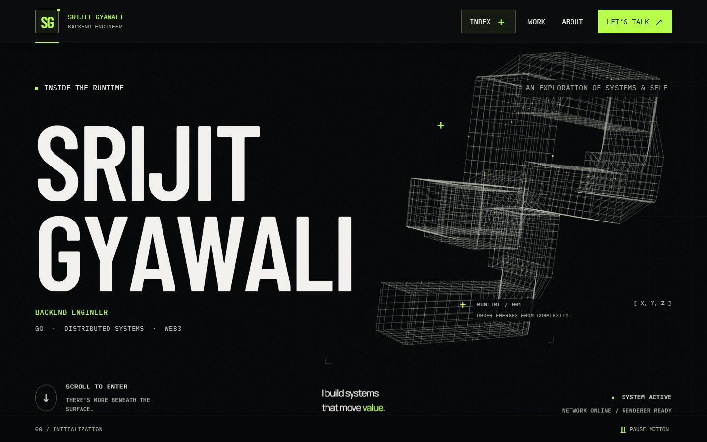
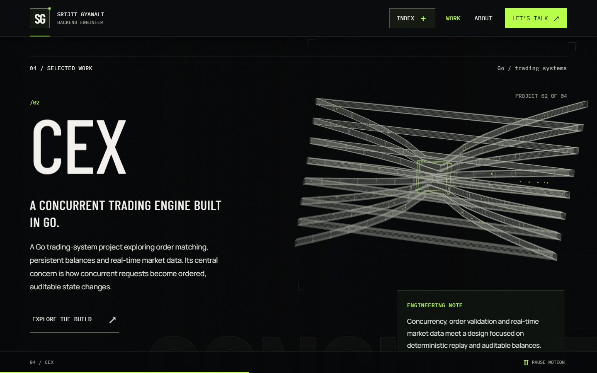
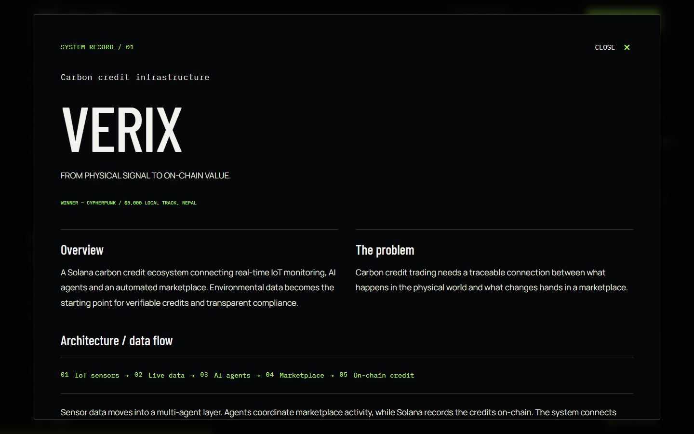
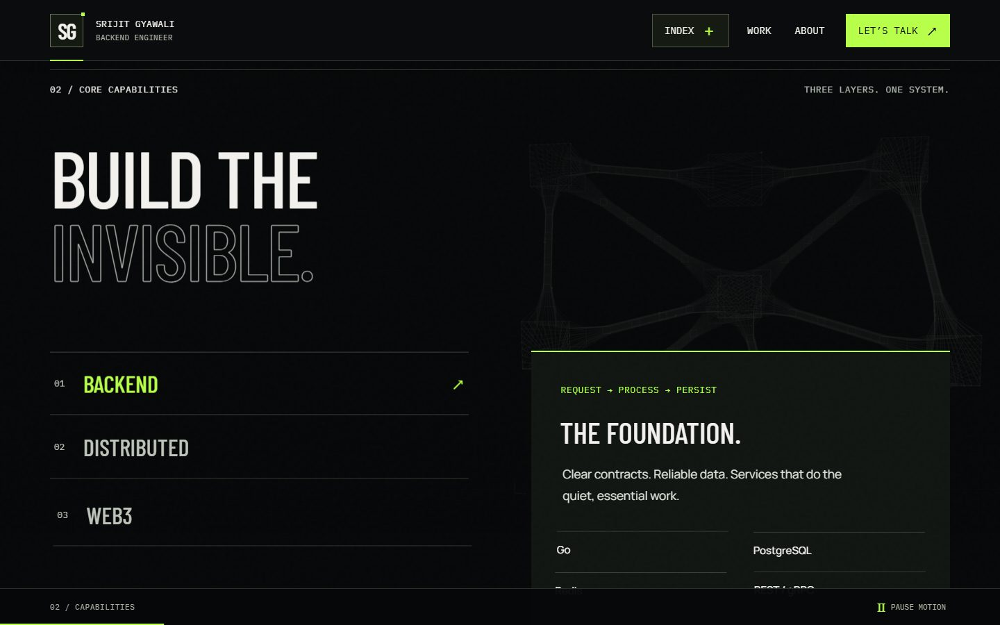
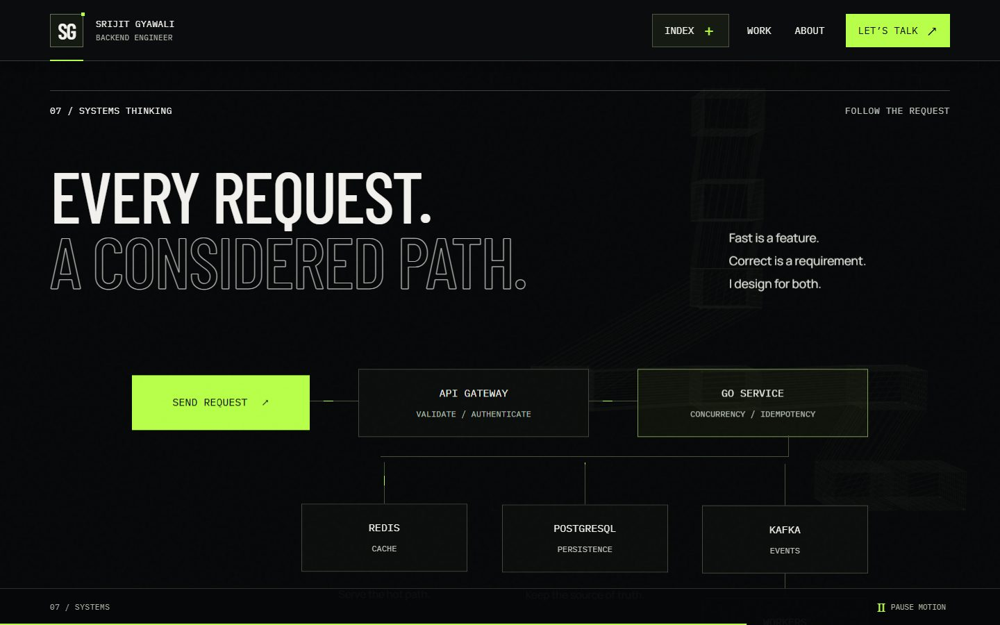
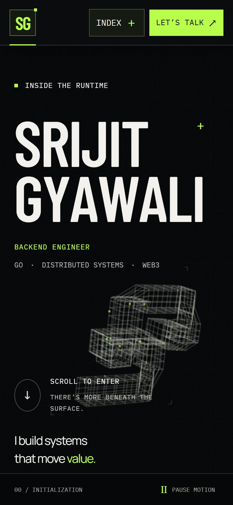
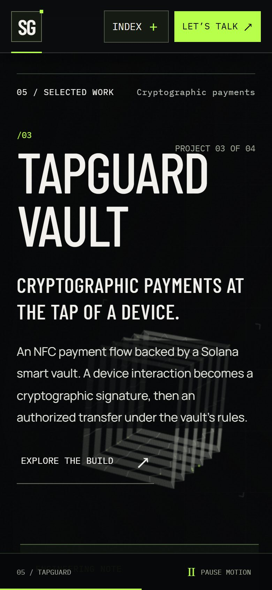

<div align="center">

# Inside the Runtime

**The portfolio of Srijit Gyawali, a backend engineer working with Go, distributed systems and Web3.**

A single-page site where a procedural 3D world reshapes itself as you scroll from one project to the next.


<br />



</div>

<br />

## About

Most portfolios put projects in a grid of cards. This one treats each project as a chapter. As you scroll, a wireframe sculpture built from a few thousand points rebuilds itself for each chapter: a mesh of sensor and ledger planes for a carbon-credit system, opposing order lanes meeting at a matching core for a trading engine, verification gates for a payment vault.

The 3D scene is decoration only. Every word on the page is real, accessible HTML. If a browser can't run WebGL, the page still shows all the content, links and navigation.

Project descriptions stick to what has been built. There are no invented metrics or links, and where a project is still in progress (like the CEX trading engine), the page says so.

## What's on the page

| # | Chapter | What you'll find |
|:--|:--|:--|
| 00 | **Hero** | Name, role and focus areas. The 3D world starts as a folded data conduit. |
| 01 | **Proof of work** | Hackathon results: Cypherpunk winner and ETHOnline 2025 second place. |
| 02 | **Core capabilities** | Three tabs (Backend, Distributed, Web3) listing the tools for each. |
| 03–06 | **Selected work** | One chapter per project with a summary, stack and data flow, plus a full write-up in a pop-up. |
| 07 | **Systems thinking** | A clickable request diagram: gateway → Go service → Redis, PostgreSQL and Kafka. |
| 08 | **The engineer** | A short bio and what Srijit is exploring right now. |
| 09 | **Contact** | Email with a copy button, GitHub and LinkedIn. |

A project index (the **INDEX** button) jumps straight to any project, and the bar at the bottom always shows which chapter you're in.

## Featured projects

| Project | What it does | Built with | Recognition | Links |
|:--|:--|:--|:--|:--|
| **Verix** | Carbon-credit system on Solana. IoT sensor data flows through AI agents into a marketplace that issues on-chain credits. | Solana, Google ADK, A2A, IoT | Winner, Cypherpunk $5,000 local track (Nepal) | — |
| **CEX** | Concurrent trading engine in Go: order validation, matching, balances and WebSocket market feeds. Deterministic replay and an auditable ledger are in progress. | Go, PostgreSQL, REST, WebSockets | — | [Source](https://github.com/SrijitGyawali/Centralized-Exchange) |
| **TapGuard Vault** | NFC tap-to-pay backed by a Solana smart vault with secp256k1 signature checks, daily spending limits and an emergency freeze. | Rust / Anchor, React, TypeScript, Web NFC | — | [Source](https://github.com/SrijitGyawali/tapguard-vault) |
| **SmartMarket** | AI agents coordinate a carbon-credit marketplace, from user intent to on-chain payment on Hedera. | Hedera Agent Kit, Google A2A | 2nd place, ETHOnline 2025 (Best Use of Hedera Agent Kit + Google A2A) | [Source](https://github.com/NirajBhattarai/a2amarketplace) · [Showcase](https://ethglobal.com/showcase/smartmarket-1g67h) |

## Screenshots

<table>
  <tr>
    <td width="50%"><br /><sub><b>Project chapter.</b> The CEX trading engine, with buy and sell lanes meeting at a matching core.</sub></td>
    <td width="50%"><br /><sub><b>Project detail.</b> Overview, problem, data flow, technical decisions and outcome.</sub></td>
  </tr>
  <tr>
    <td width="50%"><br /><sub><b>Capabilities.</b> Keyboard-friendly tabs for each engineering area.</sub></td>
    <td width="50%"><br /><sub><b>Systems thinking.</b> Press <i>Send request</i> and watch it move through the stack.</sub></td>
  </tr>
</table>

<table>
  <tr>
    <td width="25%"></td>
    <td width="25%"></td>
    <td width="50%"><b>On mobile</b><br /><br />The layout adapts down to 320px wide. The 3D scene uses fewer points, touch scrolling stays native, and every label stays readable without zooming.</td>
  </tr>
</table>

## How it's built

| Layer | Tool | Job |
|:--|:--|:--|
| UI | React 19 + TypeScript | Semantic sections, dialogs, tabs and navigation |
| Build | Vite 8 | Dev server and production bundle, with Three.js, Anime.js and StringTune in separate chunks |
| 3D | Three.js | One renderer for the whole site, with procedural geometry and custom point shaders |
| Scrolling | [StringTune](https://tune.fiddle.digital/) | Smooth desktop scrolling and the shared clock that drives all scroll animation |
| Text animation | [Anime.js](https://animejs.com/) | The hero name assembling letter by letter on load |
| Fonts | Barlow Condensed, Manrope, IBM Plex Mono | Self-hosted through Fontsource, so no requests go to Google Fonts |
| Tests | Node test runner + Playwright | Unit tests for the math, browser tests for behaviour |

### The 3D world

- **One set of points, ten shapes.** The scene has 3,360 points on desktop (1,152 on phones). Each chapter has its own formation, and all formations share the same points, so scrolling back up replays every transition in reverse.
- **The name becomes the world.** The hero name is drawn in its actual font onto a hidden canvas and sampled into points. As you scroll, those points leave the letters and join the network.
- **Nothing downloaded.** There are no 3D models or textures. Every shape is generated in code from a seeded hash, so it looks the same on every visit.

### Motion rules

- Scrolling moves text and changes its depth, but never fades or shrinks it.
- The **Pause motion** button and the system *reduce motion* setting both stop all ambient animation.
- Phones and tablets keep native touch scrolling.

### Performance

- Three.js (about 133 kB gzipped) loads in its own chunk after the page content is on screen.
- Pixel density is capped and lowered automatically if frames stay slow.
- Rendering pauses when the tab is hidden. When motion is paused, the scene only redraws if something changes.
- In local testing with desktop Chrome, the median frame took 16.7 ms (about 60 fps).

## Accessibility

- Skip link, landmark regions and a logical heading order
- Every control works from the keyboard, including arrow keys on the capability tabs
- Native `<dialog>` pop-ups that trap focus and return it to where you were
- Body text at 17–22px and header controls at least 44px tall
- Reduced-motion support plus an on-page pause button
- The custom cursor only appears on wide screens with a mouse; pop-ups always use the normal cursor
- High-contrast (forced colors) mode support

## Run it locally

You need **Node.js 22.12 or newer** and npm.

```bash
git clone https://github.com/SrijitGyawali/PORTFOLIO.git
cd PORTFOLIO
npm ci
npm run dev
```

Then open [http://localhost:5173](http://localhost:5173).

| Command | What it does |
|:--|:--|
| `npm run dev` | Starts the dev server with hot reload |
| `npm run build` | Type-checks, then builds the static site into `dist/` |
| `npm run preview` | Serves the production build locally |
| `npm run lint` | Runs ESLint |
| `npm run typecheck` | Runs the TypeScript compiler without emitting files |
| `npm test` | Runs the unit tests for the 3D geometry and scroll math |
| `npm run test:browser` | Runs the Playwright tests in Chrome and WebKit (start `npm run dev` first) |

## Deploy

`npm run build` produces a plain static folder, `dist/`. There are no environment variables, API keys or servers to set up.

**Vercel.** Import the repository at [vercel.com/new](https://vercel.com/new). Vercel detects Vite and uses `npm run build` with `dist` as the output folder.

**Netlify.** Choose *Add new site → Import an existing project*, set the build command to `npm run build` and the publish directory to `dist`.

**GitHub Pages.** Pages serves this repo from `/PORTFOLIO/`, so build with that base path and publish the result:

```bash
npm run build -- --base=/PORTFOLIO/
npx gh-pages -d dist
```

Then, under *Settings → Pages*, set the source to the `gh-pages` branch. If you run the build in Git Bash on Windows, put `MSYS_NO_PATHCONV=1` in front of it so the base path isn't rewritten.

## Updating the content

| To change | Edit |
|:--|:--|
| Email, GitHub, LinkedIn | [`src/data/profile.ts`](src/data/profile.ts) |
| Projects, stacks, awards, links | [`src/data/projects.ts`](src/data/projects.ts) |
| Capability tabs and skills | [`src/components/Capabilities.tsx`](src/components/Capabilities.tsx) |
| Hero, proof of work and about text | [`src/App.tsx`](src/App.tsx) |
| Colours, fonts, spacing | [`src/styles/global.css`](src/styles/global.css) (design tokens are at the top) |

## Project structure

```
src/
├── App.tsx              Page composition: every chapter in order
├── main.tsx             Entry point, fonts and stylesheets
├── data/                Profile and project content
├── components/          Navigation, project dialog, capabilities, architecture, contact, cursor
├── animation/           Scroll runtime (StringTune), scroll choreography, hero text animation
├── webgl/               Three.js world, procedural geometry, shaders, name sampling
└── styles/              Design tokens, layout, readability layer, navigation, scroll motion
tests/                   Playwright browser tests and a screenshot script
docs/                    Implementation notes and README screenshots
```

Design intent and principles are in [`PRODUCT.md`](PRODUCT.md). The original build plan is in [`docs/implementation.md`](docs/implementation.md).

## Testing

- **12 unit tests** check that the 3D formations are valid and deterministic, that scroll motion reverses exactly, and that text keeps full contrast at every scroll position.
- **23 browser tests** cover the project dialogs, keyboard navigation, the project index, scroll and history behaviour, motion pause, reduced motion, layouts down to 320px, copying the email address, and what happens when WebGL or the 3D code fails to load.

WebKit tests use Playwright's WebKit engine, which is close to Safari but not the same as testing on a real iPhone. Firefox tests are optional: run `npx playwright install firefox` and then `npm run test:browser:firefox`.

## Contact

**Srijit Gyawali**, backend engineer

[gyawalisrijit@gmail.com](mailto:gyawalisrijit@gmail.com) · [GitHub](https://github.com/SrijitGyawali/) · [LinkedIn](https://www.linkedin.com/in/srijit-gyawali-09aa7a233/)
